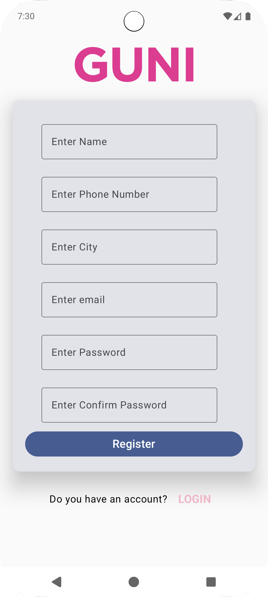

# Mobile Application Development - Practical 5

## Project Overview
This Android application demonstrates the implementation of **Jetpack Compose Navigation** with a complete user authentication flow. The app features a modern UI design with login and registration screens, showcasing navigation between different composable screens.

## What We Built
This practical focuses on creating a user authentication system with the following key features:

### 🔐 Authentication Screens
- **Login Screen**: User login interface with email and password fields
- **Registration Screen**: User registration form with comprehensive input fields
- **Navigation Flow**: Seamless navigation between login and registration screens

### 🎨 UI Components
- **Custom Form Fields**: Reusable input components with validation
- **Material Design 3**: Modern UI following Material Design guidelines
- **Card-based Layout**: Elevated card design for form containers
- **Brand Integration**: Guni Pink logo integration

### 🧩 Technical Implementation
- **Jetpack Compose**: Modern declarative UI framework
- **Navigation Compose**: Screen-to-screen navigation
- **State Management**: Reactive state handling with `remember` and `mutableStateOf`
- **Custom Components**: Reusable form field components

## Project Structure

```
app/src/main/java/com/bytemap/mad_24172012068_practical5/
├── MainActivity.kt                 # Main activity entry point
├── AppNavigation.kt               # Navigation configuration
└── screen/components/
    ├── LoginScreen.kt             # Login screen implementation
    ├── RegisterScreen.kt          # Registration screen implementation
    └── FormFields.kt              # Custom form field components
```

## Key Features Implemented

### 1. Navigation System
- **NavHost**: Configured with login as the starting destination
- **Composable Routes**: Defined routes for "login" and "register" screens
- **Navigation Controller**: Handles screen transitions

### 2. Login Screen
- Email and password input fields
- "Forgot Password?" link
- Login button (ready for authentication logic)
- Navigation to registration screen

### 3. Registration Screen
- Complete user information form:
  - Name
  - Phone Number (numeric input validation)
  - City
  - Email
  - Password
  - Confirm Password
- Registration button (ready for backend integration)
- Navigation back to login screen

### 4. Custom Form Components
- **FormField**: Generic input field component
- **NumbericOutlineTextField**: Numeric input with validation
- **Password Support**: Secure password input with visual transformation
- **Validation**: Input type validation and formatting

## Technical Specifications

- **Minimum SDK**: 24 (Android 7.0)
- **Target SDK**: 36 (Android 14)
- **Language**: Kotlin
- **UI Framework**: Jetpack Compose
- **Navigation**: Navigation Compose
- **Material Design**: Material 3

## Dependencies Used

- `androidx.compose.ui` - Compose UI framework
- `androidx.compose.material3` - Material Design 3 components
- `androidx.navigation.compose` - Navigation for Compose
- `androidx.activity.compose` - Activity integration

## How It Works

1. **App Launch**: The app starts with the login screen as the default destination
2. **User Interaction**: Users can input credentials or navigate to registration
3. **Screen Navigation**: Seamless transitions between login and registration screens
4. **Form Validation**: Input fields provide real-time validation and formatting
5. **State Management**: Form data is managed using Compose's state system

## Screenshots

<!-- Add your screenshots here -->
<div align="center">
  
  
</div>
## Future Enhancements

- Backend integration for actual authentication
- Form validation and error handling
- User session management
- Password strength indicators
- Remember me functionality
- Social login options

## Learning Outcomes

This practical demonstrates:
- Jetpack Compose navigation implementation
- Custom component creation and reusability
- State management in Compose
- Material Design 3 integration
- Modern Android development practices
- UI/UX design principles

---

**Student**: Pratham (24172012068)  
**Course**: Mobile Application Development  
**Practical**: 5 - Jetpack Compose Navigation
